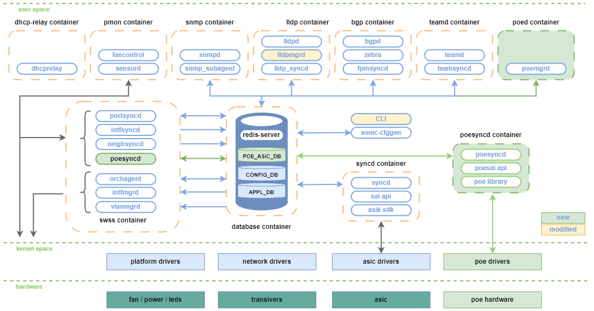

# SONiC PoE #

## Table of Content 

- [Revision](#revision)
- [Scope](#scope)
- [Definition/Abbreviation](#definitions_abbreviations)
- [Overview](#overview)
- [Requirements](#requirements)
- [Architecture Design](#architecture-design)
  - [PoE interaction](#poe-interaction)
  - [SWSS changes](#swss-changes)
  - [PoE SYNCD](#poe-syncd)
  - [PoE Manager](#poe-manager)
  - [LLDP Manager](#lldp-manager-modified)
- [High-Level Design](#high-level-design)
  - [PoE flows](#poe-flows)
    - [PoE data collection](#poe-data-collection)
    - [PoE configuration](#poe-configuration)
- [SAI API](#sai-api)
- [PoE AI](#poe-abstraction-interface)
- [Configuration and management](#configuration-and-management)
  - [CLI/YANG model Enhancements](#cli_yang-model-enhancements)
    - [Show commands](#show-commands)
    - [Config commands](#config-commands)
  - [Config DB Enhancements](#config-db-enhancements)
  - [State DB Enhancements](#state-db-enhancements)
- [Restrictions/Limitations](#restrictions_limitations)

### Revision

 | Rev | Date |     Author     | Change Description |
 |:---:|:----:|:--------------:|--------------------|
 | 0.1 | 03-26-2024 | Volodymyr Mytnyk |  Initial version |
 | 0.2 | 04-01-2024 | Volodymyr Mytnyk |  Add SWSS cahnges, include LLDP interaction, add example PoE config, mention about warm reboot requirements |
 | 0.3 | 10-06-2024 | Serhiy Boiko |  Update poe configuration json, SAI attributes, appl_db and conf_db tables, and CLI output; add yang models |

### Scope  

This document provides general information about the PoE (Power over Ethernet) feature implementation in SONiC.

### Definitions/Abbreviations 

|                          |                                |
|--------------------------|--------------------------------|
| PoE                      | Power over Ethernet |

### Overview 

Ethernet switch (e.g. campus specific platforms) today often comes with Power over Ethernet (PoE) feature support. PoE functioalility itself is considered as an external functionality from NPU SAI/SDK point of view as it is configurable via external PoE controller.


### Requirements

- PoE feature can be enabled via compile option (disabled by default);
- PoE config persistence during SONiC reboot;
- Support CLI configurations as mentioned in [config section](#config-commands) and [show section](#show-commands);
- LLDP support (PoE power reporting only, future releases);
- Warm boot;

### Architecture Design 

In order to isolate PoE functionality and complexity from existing SONiC design, the following main changes are made:

- Add separate container for PoE control plane routine configuration.
- Introduce separate SYNCD container to support external PoE Abstraction Interface.
- Add new PoE tables into database container.

The following diagram explains the changes needed in existing SONiC architecture.



#### PoE interaction

This section describes the detail interaction of PoE componnents, DB and PoE hardware (controller) in SONiC subsytem.


#### SWSS changes

In case to support external and separate PoE SAI, and following SONiC architecture design, SWSS container needs to be extended
with PoE orch deamon that will handle all PoE ASIC DB requests and does PoE initialization.


#### PoE SYNCD

New PoE SYNCD container componnents:
- *poesyncd* - syncd poe configuration between db and poe pse devices
- *poe sai api* - PoE Abstraction interface to configure PoE controller (see [PoE AI section](#poe-abstraction-interface))
- *poe library*- library that has low level poe logic and the transportation to and from the hardware

##### PoE library

The PoE library has lower level PoE software logic, and the transportation to and from the PoE hardware. This includes reading and/or writing PoE information such as power consumption, PSE temperatures, port status, port admin state and more.
As long as the library supports the saipoe.h file, it can be changed per board/vendor, and the functionality will stay the same.

#### PoE manager

PoE manager consists of a daemon that implements the following functionality:

- Making sure that the PSEs are functional;
- Collect variable PoE data periodically;
  - PoE status;
  - PoE protocol and class;
  - PoE power, current and voltage;
  - PSE information;
- Apply PoE controller configuration;
- Track changes in config, appl DB;

##### Configuration

Below is a example of PoE configuration used by PoE manager on start up. The mapping between PoE port and ASIC port is done via front panel id.
```json
[
  {
    "hw_info": "mcu1",
    "power_limit_mode": "port",
    "pse_list": [
      {
        "pse_index": 0
      },
      {
        "pse_index": 1
      }
    ],
    "port_mapping_list": [
      {
        "interface": "Ethernet0",
        "front_panel_index": 1,
        "power_priority": "crit"
      },
      {
        "interface": "Ethernet1",
        "front_panel_index": 2,
        "power_priority": "high"
      }
    ]
  },
  {
    "hw_info": "mcu2",
    "pse_list": [
      {
        "pse_index": 2
      }
    ],
    "port_mapping_list": [
      {
        "interface": "Ethernet2",
        "front_panel_index": 3,
        "power_priority": "low"
      }
    ]
  }
]
```

#### LLDP manager (modified)

To exchange the PoE information with peer about power supply capability, the LLDP protocol is used. In case to support
that, LLDP manager is required to be modified as following:

- LLDP manager gets PoE information (from application PoE database).
- LLDP manager adds LLDP TLV with PoE information into LLDP packet.
- LLDP negotiation (future versions).

### High-Level Design 

This section covers the high level design of the built-in SONiC PoE feature.

This section covers the following points in detail.

	- Existing moduels are not modified by this design.
	- Repositories that will be changed: sonic-buildimage, sonic-swss, sonic-swss-common, sonic-sairedis, sonic-utilities.
	- Module/sub-module interfaces and dependencies.
	- SWSS and Syncd are not changed.
	- This design doesn't change existing DB Schema, only new are added.
	- Linux dependencies and interface
	- Fastboot requirements & dependencies
	- Scalability and performance requirements/impact
	- Memory requirements
	- Docker dependency
	- Build dependency if any
	- Management interfaces - SNMP, CLI, RestAPI, etc.,
	- Serviceability and Debug (logging, counters, trace etc) related design
	- Is this change specific to any platform? Are there dependencies for platforms to implement anything to make this feature work? If yes, explain in detail and inform community in advance.
	- SAI API requirements, CLI requirements, ConfigDB requirements. Design is covered in following sections.

##### PoE flows

###### PoE data collection

"Show" flow:
  1. Get PoE controller information;
  2. Update state DB with the PoE status;
  3. Repeat step 1-2 each seconds (optional);
  4. SONiC CLI read and display PoE infomation from state DB;


###### PoE configuration

Configuration flow:
  1. Configure PoE using SONiC CLI;
  2. Update Config DB accordingly;
  3. Poemgrd subscribe to related tables in Config DB;
  4. Call PoE AI for related configuration;


### SAI API 

- SAI object types extended to support PoE
- SAI API list is extended to supprot PoE
- New PoE switch type added

### PoE Abstraction Interface

The PoE Manager uses a new SAI PoE library that implements the PoE Abstraction Interface.

#### Device Capabilities

| Capabilities      | SAI attributes                        |
| ----------------- | ------------------------------------- |
| Hardware Info     | SAI_POE_DEVICE_ATTR_HARDWARE_INFO     |
| PSE List          | SAI_POE_DEVICE_ATTR_POE_PSE_LIST      |
| List of ports     | SAI_POE_DEVICE_ATTR_POE_PORT_LIST     |
| Total Power       | SAI_POE_DEVICE_ATTR_TOTAL_POWER       |
| Power Consumption | SAI_POE_DEVICE_ATTR_POWER_CONSUMPTION |
| Version           | SAI_POE_DEVICE_ATTR_VERSION           |
| Power Limit Mode  | SAI_POE_DEVICE_ATTR_POWER_LIMIT_MODE  |


#### PSE Capabilities

| Capabilities    | SAI attributes                        |
| --------------- | ------------------------------------- |
| PSE ID          | SAI_POE_PSE_ATTR_ID                   |
| PSE SW Version  | SAI_POE_PSE_ATTR_PSE_SOFTWARE_VERSION |
| PSE HW Version  | SAI_POE_PSE_ATTR_PSE_HARDWARE_VERSION |
| PSE Temperature | SAI_POE_PSE_ATTR_TEMPERATURE          |
| PSE Status      | SAI_POE_PSE_ATTR_PSE_STATUS           |

#### Port Capabilities

| Capabilities            | SAI attributes                        |
| ----------------------- | ------------------------------------- |
| Front Panel ID          | SAI_POE_PORT_ATTR_FRONT_PANEL_ID      |
| Standard                | SAI_POE_PORT_ATTR_STANDARD            |
| Admin Enable State      | SAI_POE_PORT_ATTR_ADMIN_ENABLED_STATE |
| Power Limit             | SAI_POE_PORT_ATTR_POWER_LIMIT         |
| Power Priority          | SAI_POE_PORT_ATTR_POWER_PRIORITY      |
| Voltage, current, etc.  | SAI_POE_PORT_ATTR_CONSUMPTION         |
| Status                  | SAI_POE_PORT_ATTR_STATUS              |


### Configuration and management 

#### Manifest (if the feature is an Application Extension)
Feature is not an Application Extension

#### CLI

##### Show commands
- show poe status
```
  Id    PoE ports  Total power    Power consump    Power available    Power limit mode    HW info    Version
----  -----------  -------------  ---------------  -----------------  ------------------  ---------  ---------
   0            2  100.000 W      10.000 W         90.000 W           port                mcu1       0.1.2.3
   1            1  100.000 W      10.000 W         90.000 W           class               mcu2       0.1.2.3
```


- show poe pse status
```
  Id  Status    Temperature    SW ver            HW ver
----  --------  -------------  ----------------  ----------------
   0  active    25.000 C       0.1.2.3           4.5.6.7
   1  active    25.000 C       0.1.2.3           4.5.6.7
   2  active    25.000 C       0.1.2.3           4.5.6.7
```


- show poe interface status \[ifname\]
```
Port         Status      En/Dis    Priority    Protocol          Class A    Class B  PWR Consump    PWR limit    Voltage    Current
-----------  ----------  --------  ----------  --------------  ---------  ---------  -------------  -----------  ---------  ---------
Ethernet0    delivering  enable    crit        802.3bt Type 3          2          4  10.000 W       50.000 W     50.000 V   0.200 A
Ethernet1    delivering  enable    high        802.3bt Type 3          2          4  10.000 W       50.000 W     50.000 V   0.200 A
Ethernet2    delivering  enable    low         802.3bt Type 3          2          4  10.000 W       50.000 W     50.000 V   0.200 A
```


- show poe interface configuration \[ifname\]
```
Port         En/Dis      Power limit  Priority
-----------  --------  -------------  ----------
Ethernet0    enable               50  crit
Ethernet1    enable               50  high
Ethernet2    enable               50  low
```


##### Config commands

- config poe interface status \<ifname\> {enable | disable}
- config poe interface priority \<ifname\> {crit | high | low}
- config poe interface power-limit \<ifname\> {power_limit}

Examples:
```
$ config poe interface status Ethernet0 enable
$ config poe interface priority Ethernet0 high
$ config poe interface power-limit Ethernet0 20.4
```

**TODO**: update CLI reference https://github.com/sonic-net/sonic-utilities/blob/master/doc/Command-Reference.md

#### YANG model Enhancements

```yang
//filename: sonic-poe.yang
module sonic-poe {
    yang-version 1.1;
    namespace "http://github.com/sonic-net/sonic-poe";
    prefix poe;

    import sonic-types {
        prefix stypes;
    }

    import sonic-port {
        prefix port;
    }

    organization
        "SONiC";

    contact
        "SONiC";

    description
        "PoE YANG Module for SONiC OS";

    revision 2024-06-13 {
        description
            "First Revision";
    }

    container sonic-poe {

        container POE_PORT {

            description "Power over Ethernet configuration (POE_PORT table in config_db.json)";

            typedef poe-priority {

                type enumeration {
                    enum crit;
                    enum high;
                    enum low;
                }
            }

            list POE_PORT_LIST {
                key "ifname";
                leaf ifname {
                    type leafref {
                        path /port:sonic-port/port:PORT/port:PORT_LIST/port:name;
                    }
                    description "Interface name from the PORT table in config_db.json";
                }
                leaf enabled {
                    type stypes:mode-status;
                    default disable;
                    description "PoE status on port. [enable/disable]";
                }
                leaf pwr_limit {
                    mandatory true;
                    type string {
                        length 1..255;
                    }
                    description "Power limit on PoE port. [0..999]";
                }
                leaf priority {
                    type poe-priority;
                    default high;
                    description "Port priority level. [crit/high/low]";
                }
            }
            /* end of POE_PORT_LIST */
        }
        /* end of container POE_PORT */
    }
    /* end of top-level container sonic-poe */
}
/* end of module sonic-poe */
```

#### Config DB Enhancements

New table has been added to the config database to store related PoE configuration parameters:

##### POE_PORT
~~~
    ; Stores PoE port configuration
    key         = POE_PORT|ifname         ; ifname with prefix POE_PORT
    ; field     = value
    enabled     = "enable" / "disable"    ; enable/disable PoE on port, default "disable"
    pwr_limit   = 1*3.1DIGIT              ; power limit on PoE port
    priority    = "crit" / "high" / "low" ; port priority level, default "high"
~~~

#### State DB Enhancements

In SONiC all the peripheral devices data (information relared to PoE) will be stored in state database in separated tables:

#### POE_DEVICE_TABLE
~~~
    ; Defines information for a PoE device
    key            = POE_DEVICE_TABLE|id  ; key
    ; field        = value
    total_ports    = 1*2DIGIT             ; total PoE ports
    total_pwr      = 1*4.3DIGIT           ; total power
    pwr_consump    = 1*4.3DIGIT           ; total power consumption
    pwr_limit_mode = STRING               ; power limit mode
    hw_info        = STRING               ; hardware info
    version        = STRING               ; hardware version
~~~

#### POE_PSE_TABLE
~~~
    ; Defines information for a global PoE state
    key         = POE_PSE_TABLE|id                  ; key
    ; field     = value
    sw_ver      = STRING                            ; PSE software version
    hw_ver      = STRING                            ; PSE hardware version
    temperature = 1*3DIGIT                          ; PSE temperature
    status      = "active" / "fail" / "not present" ; PSE status
~~~

#### POE_PORT_TABLE
~~~
    ; Defines information for a PoE port state
    key         = POE_PORT_TABLE|ifname   ; ifname with prefix POE_PORT_TABLE
    ; field     = value
    fp_port     = 1*2DIGIT                                    ; PoE front panel port (map PoE port num to ifname)
    status      = "off" / "searching" / "delivering" / "fail" ; interface status
    enabled     = "enable" / "disable"    ; PoE enabled on port
    priority    = "crit" / "high" / "low" ; port priority level
    protocol    = STRING                  ; name of PoE protocol
    class_a     = 1*DIGIT                 ; power class for channel a
    class_b     = 1*DIGIT                 ; power class for channel b
    pwr_consump = 1*3.3DIGIT              ; current power draw of the port
    pwr_limit   = 1*3.3DIGIT              ; power capacity of the PoE port
    voltage     = 1*3.3DIGIT              ; output voltage of the PoE port
    current     = 1*3.3DIGIT              ; the current of the PoE port
~~~


### Warmboot and Fastboot Design Impact  

In scope of current desgin, the PoE functionality should continue to work across warm boot. The PoE configuration is present in the ASIC database and therefore should be compatible with existing SYNCD and its warm boot capabilities.

### Memory Consumption
This sub-section covers the memory consumption analysis for the new feature: no memory consumption is expected when the feature is disabled via compilation and no growing memory consumption while feature is disabled by configuration. 

### Restrictions/Limitations  

### Testing Requirements/Design  

Testing of PoE functionality are covered by unit & system testing.

#### Unit Test cases

PoE components (like PoE syncd, REDIS API) can be validated and covered by mocking PoE SAI API. The existing syncd unit tests can be extended to cover PoE functionality.

#### System Test cases

System testing can be done only on systems with PoE hardware support.

TBD

### Open/Action items

- SONiC Yang models needs to be provided as a part of this design.